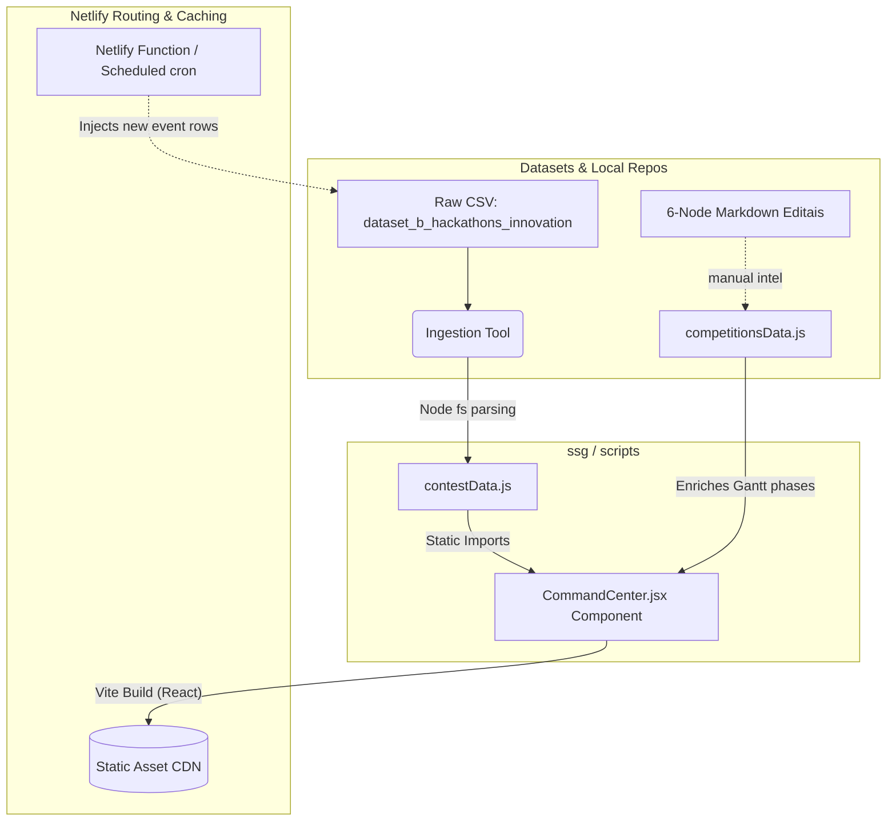

# Netlify Data Pipeline & Serverless Architecture

This document diagnoses and outlines the architectural topology for the **Competitive Programming Intelligence Dashboard (Command Center)**, specifically mapping the data flow from CSV origin to Netlify production deployment.

## 1. Top-Level Data Flow Topology

The system operates on an automated Data Enrichment and Normalization Pipeline, executing at build-time (and ultimately via Serverless extensions) to serve a heavily optimized React Frontend layout.



## 2. Pipeline Components Diagnosis

### 2.1 Static Site Generation (SSG) / Ingestion
Currently, the events are updated via a one-way transformation script (`scripts/ingest_datasets.js`). 
- **Trigger**: Run locally prior to commit (`node scripts/ingest_datasets.js`).
- **Function**: Converts heavily nested CSV columns (tiers, location, prize pools, tech stacks) into an exported array inside `src/data/contestData.js`.
- **Diagnosis**: Robust and simple. However, it relies heavily on local, manual triggering.

### 2.2 UI Data Enrichment (`competitionsData.js`)
Only competitions requiring active participation receive "enriched" timelines (Phases, Deliverables, Strategic Notes).
- **Function**: The frontend merges `contestData.js` core definitions with `competitionsData.js` tactical timelines on the fly.
- **State Management**: `localStorage` records individual checklist milestones marked by the user. 
- **Diagnosis**: This decoupling prevents the UI engine from getting bogged down. It correctly maps qualitative markdown files (e.g., from `01_Intel_OSINT`) into quantifiable JSON `deliverables`.

## 3. Serverless Extensibility (Injecting Data via Netlify)

To move away from purely local/manual commits for new events, Netlify provides highly capable Background and Scheduled Functions. 

### Scenario: The Event Scraper / Webhook Injector

Currently, to update the Gantt chart with a new hackathon, you modify the CSV and push. With Netlify Functions, you can decouple this.

#### Step 1: The Automation Function
You place a serverless script under `netlify/functions/update-datasets.js` or `netlify/functions/update-datasets-background.js`. This function can:
1. Listen for webhooks from an external source (like a scraper or CMS).
2. Fetch an external Google Sheet or external DB that hosts `dataset_b_hackathons_innovation`.
3. Hit the GitHub API to update your `dev-portfolio` repository programmatically.

#### Step 2: Triggering CI/CD
By utilizing a GitHub API commit, the Netlify CI runner will naturally trigger, initiating `npm run build` which runs the native ingestion pipeline without user intervention.

### Example Function Blueprint
```javascript
// netlify/functions/sync-competition-intel.js
import { schedule } from '@netlify/functions';

export const handler = schedule('@daily', async (event) => {
    // 1. Fetch latest external event RSS/scraped data
    const upcomingEvents = await fetch('external-intel-engine-api');
    
    // 2. If new events detected, push a commit to GitHub using Octokit
    const octokit = new Octokit({ auth: process.env.GITHUB_PAT });
    await octokit.repos.createOrUpdateFileContents({
        owner: 'your-user', repo: 'dev-portfolio',
        path: 'datasets/dataset_b_hackathons_innovation.csv',
        // ... new csv blob
    });
    
    // Netlify will auto-deploy the UI update
    return { statusCode: 200 };
});
```

## 4. Netlify Delivery Optimization

Your `netlify.toml` correctly sets cache-control on static assets (`**/*.js` and `**/*.css` map to `public, max-age=31536000, immutable`), meaning the UI operates entirely off edge cache. 
- **Security Check**: The current setup redirects `/*` to `/index.html` (Status 200), ensuring React Router controls all paths, and no static file resolution interrupts the SPA lifecycle.

## 5. Conclusion
Your current Data Pipeline operates efficiently as an SSG topology. Extending this architecture to Serverless will only require setting up simple, stateless Netlify functions that authenticate with the GitHub API to append to the CSV repository, allowing the intelligence node to "auto-update" the Command Center interface securely and rapidly.
